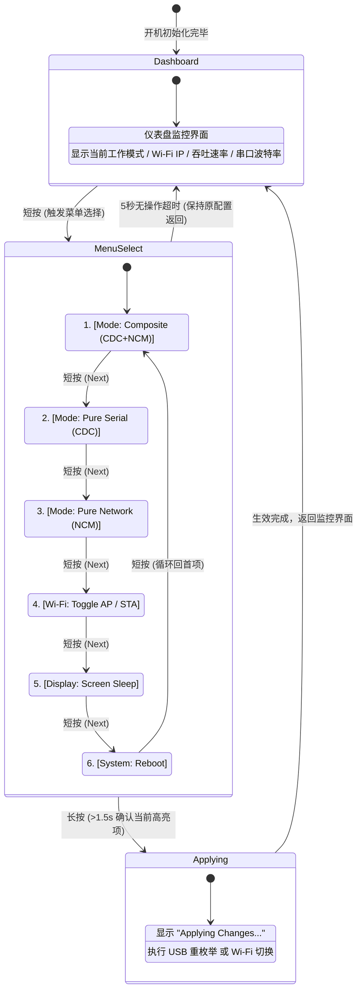

# ESP32-S3-GEEK 无线调试器（Wireless Debugger）架构设计方案

> **项目定位**：基于 Waveshare ESP32-S3-GEEK 开发板，利用其板载 USB-A 接口直接插入 Target Linux 目标机，将其虚拟为 USB 调试设备（串口 CDC-ACM / 虚拟网卡 CDC-NCM 复合设备或动态切换单设备）；同时借助 ESP32-S3 的 Wi-Fi 能力与 Host 电脑建立无线通道，实现免物理线缆的远程串口救砖、内核日志监控、网络 SSH 访问与文件传输。
> **核心交互特色**：板载 1.14 寸 LCD 实时仪表盘监控；板载 BOOT 单按键实现 **“短按循环切换候选菜单，长按确认执行并切换模式”**。

---

## 一、硬件资源与引脚分配表 (Hardware Pinout)

ESP32-S3-GEEK 是一款集成 USB-A 插头的便携式 ESP32-S3 开发棒。核心硬件资源参数与实际引脚映射如下：

### 1. 核心芯片与存储
- **SoC**: ESP32-S3R2（Xtensa® 32 位 LX7 双核处理器，最高 240 MHz）
- **PSRAM**: 2MB Quad SPI PSRAM（内部封装）
- **Flash**: 16MB SPI Flash
- **Wi-Fi / BLE**: 2.4 GHz Wi-Fi (802.11 b/g/n) + Bluetooth 5 (LE)

### 2. 板载外设与 GPIO 映射
| 功能模块 | 芯片/接口 | 关键引脚 (GPIO) | 说明 |
| :--- | :--- | :--- | :--- |
| **USB 原生接口** | USB-A 公头 (USB 2.0 FS) | **GPIO 19** (D- / DM)<br>**GPIO 20** (D+ / DP) | ESP32-S3 原生 USB-OTG 控制器，用于与 Target Linux 通信 |
| **物理按键** | BOOT 按键 (KEY0) | **GPIO 0** | 板载按键，硬件默认上拉，按下为低电平（Active Low） |
| **1.14 寸 IPS 屏幕** | ST7789V (240 × 135) | **GPIO 11** (MOSI / SDA)<br>**GPIO 12** (SCLK / SCL)<br>**GPIO 10** (CS)<br>**GPIO 8** (DC / 命令数据)<br>**GPIO 9** (RST / 复位)<br>**GPIO 7** (BL / 背光控制) | SPI2 通信；背光由 GPIO7 控制，支持 LEDC PWM 调光 |
| **MicroSD / TF 卡** | SDIO / SPI 槽 | GPIO 38~42 等 | 适合用于持久化保存调试日志、离线抓包 PCAP 文件等 |
| **板载扩展排针** | 3PIN UART / 4PIN I2C | UART (GPIO 43/44)<br>I2C (GPIO 5/6) | 可备用于外接硬件串口探针或扩展传感器 |

---

## 二、系统整体架构与数据流 (System Architecture)

```
 +-------------------------------------------------------------------------+
 |                          Host 调试电脑 (PC / Mac)                        |
 |                                                                         |
 |    [浏览器 WebShell (xterm.js)]       [终端 SSH / Telnet / 抓包 Wireshark] |
 +-----------------------^---------------------------------^---------------+
                         |                                 |
                         | 2.4G Wi-Fi (AP 或 局域网 STA)     |
                         v                                 v
 +-------------------------------------------------------------------------+
 |                      ESP32-S3-GEEK (插在 Target 上)                      |
 |                                                                         |
 |  +--------------------+  +----------------------+  +-----------------+  |
 |  | WebServer/WebSocket|  | lwIP 协议栈 / NAPT   |  | 状态机 & UI     |  |
 |  | 串口终端桥接 (Telnet)|  | DHCP Server (192.x)  |  | ST7789 驱动     |  |
 |  +----------^---------+  +----------^-----------+  +--------^--------+  |
 |             |                       |                       |           |
 |             +---------+   +---------+                       | 按键事件   |
 |                       |   |                                 |           |
 |      [TinyUSB 协议栈: 复合设备 CDC-ACM + CDC-NCM/RNDIS]    [GPIO 0 按键] |
 |                       |   |                                             |
 |                       v   v                                             |
 |           原生 USB-OTG (GPIO 19/20)                                      |
 +-----------------------+-------------------------------------------------+
                         | 物理连接 (USB-A 插入)
                         v
 +-------------------------------------------------------------------------+
 |                         Target Linux 目标机                              |
 |                                                                         |
 |   串口控制台: /dev/ttyACM0              虚拟网络接口: usb0 (192.168.4.2) |
 |   (开机日志输出 / Getty 登录终端)          (可运行 SSHD / 接收远程指令)    |
 +-------------------------------------------------------------------------+
```

---

## 三、“短按切换，长按确认” 按键与 UI 状态机

为了在无须外接电脑配置的情况下，仅靠单按键和 1.14 寸小屏即可完成调试器模式与网络配置，采用严格的**软件消抖与长短按时间窗口判定算法**。

### 1. 按键事件判定逻辑
- **硬件特性**：GPIO 0 平时为高电平（1），按下时为低电平（0）。
- **消抖时间（Debounce）**：20 ms。
- **短按（Short Click）**：按下保持时间在 **50ms ~ 600ms** 之间，在**按键抬起（Release）**时判定为一次有效短按。
- **长按（Long Press）**：按下保持时间超过 **1500ms**，在达到阈值瞬间立刻触发长按事件（此时蜂鸣器或屏幕高亮提示，用户抬手即可）。
- **长按进度指示**：当按下超过 600ms 未抬起时，屏幕底部绘制进度条或模式反色闪烁，给予用户清晰的视觉反馈。

```
按键电平:
  HIGH -----\                 /------------------------
            |                 |
  LOW       \_________________/
            <-- Press Duration ->
            [0 ~ 50ms]      : 忽略抖动
            [50ms ~ 600ms]  : 短按 (释放时触发: 下一项选择)
            [> 1500ms]      : 长按 (达到阈值即刻触发: 确认生效)
```

### 2. UI 界面与交互状态流转 (State Machine)



### 3. 屏幕 UI 布局细节 (ST7789 240×135 像素点阵)

#### 界面 A：仪表盘监控状态 (Dashboard)
```
+----------------------------------------+
| [MODE: CDC+NCM]   [WIFI: AP]  [CLI: 1] | <- 状态顶栏 (反色高亮)
+----------------------------------------+
| Host Wi-Fi:  192.168.4.1 (AP Mode)     |
| Target IP:   192.168.4.2 (usb0)        |
| Baudrate:    115200 8N1                |
| USB Traffic: RX: 12.4KB/s  TX: 1.2KB/s |
| [●] Serial Active     [●] Net Link Up  |
+----------------------------------------+
```

#### 界面 B：菜单选择状态 (Menu Selection)
```
+----------------------------------------+
| >> SELECT MODE (Short: Next / Long: OK)|
+----------------------------------------+
|   [1] Composite (Serial + Ethernet)  * | <- 当前生效项标记 '*'
| > [2] Pure Serial (CDC-ACM)            | <- 当前选中的候选高亮条
|   [3] Pure Ethernet (CDC-NCM)          |
|   [4] Wi-Fi Mode (AP / STA)            |
+----------------------------------------+
| [Hold to Confirm]  =====>              | <- 长按蓄力进度条
+----------------------------------------+
```

---

## 四、USB 复合设备与动态切换方案 (USB Architecture)

### 1. 为什么优先推荐“思路 A（复合设备）”？
- **零等待**：Linux 系统识别到物理 USB 插入后，udev 会并发加载 `cdc_acm` 和 `cdc_ncm` 驱动。
- **双管齐下**：
  - **救砖/内核控制台**：目标机 Linux 甚至还在 U-Boot / initramfs 阶段，或者崩溃报 Kernel Panic 时，串口 `ttyACM0` 仍可正常输出调试信息。
  - **网络与高性能传输**：一旦 Linux 进入系统，`usb0` 虚拟网卡自动通过 DHCP 获取 IP，Host 端即可通过 SSH 打开多个 Shell 窗口，并以几 MB/s 的速度 SCP 传输调试工具包或固件。

### 2. TinyUSB 描述符与端点规划 (Endpoint Allocation)
ESP32-S3 的 USB-OTG 外设拥有有限的双向端点（通常支持 5~7 个 IN/OUT 端点）。合理规划如下：

| 接口 ID | 接口类型 | 所属类 | 端点配置 | 用途 |
| :--- | :--- | :--- | :--- | :--- |
| **ITF 0** | CDC-ACM (Comm) | CDC Control | `EP 1 IN` (Interrupt, 64B) | 串口控制通知 |
| **ITF 1** | CDC-ACM (Data) | CDC Data | `EP 2 OUT` (Bulk, 64B)<br>`EP 2 IN` (Bulk, 64B) | 串口数据收发 |
| **ITF 2** | CDC-NCM (Comm) | CDC Control | `EP 3 IN` (Interrupt, 64B) | 网络状态通知 |
| **ITF 3** | CDC-NCM (Data) | CDC Data | `EP 4 OUT` (Bulk, 64B)<br>`EP 4 IN` (Bulk, 64B) | 以太网帧传输 (MTU 1500) |

> **端点总计**：占用 4 个非 0 端点（EP1~EP4），完全在 ESP32-S3 硬件端点能力范围内，无需担心硬件资源耗尽。

### 3. 动态切换（思路 B）的工作机制
当用户在菜单中选择“单串口”或“单网卡”模式并长按确认时：
1. **断开 USB 总线**：调用 TinyUSB 的 `tud_disconnect()`，将 GPIO 19/20 的 D+/D- 下拉，模拟物理断开。
2. **销毁/重新配置描述符**：卸载当前配置，切换为单一 CDC-ACM 或单一 CDC-NCM 描述符表。
3. **重新枚举**：调用 `tud_connect()`，重新上拉 D+（Full-Speed 12Mbps），Target Linux 收到 USB Connect 中断，重新枚举驱动。

---

## 五、网络与通信转发机制 (Network & Bridge)

```
Target Linux (usb0: 192.168.4.2)
     ^
     | [CDC-NCM]
     v
ESP32-S3 (内部 lwIP 协议栈)
     ├── netif_ncm:  192.168.4.1 (DHCP Server 为 Target 分配 192.168.4.2)
     ├── netif_wifi: 192.168.4.1 (Wi-Fi AP) 或 192.168.x.x (STA 模式)
     └── 转发引擎:
           ├── IP 路由 / NAPT (允许两端透明互通)
           └── Port Forwarding (例如将 ESP32 的 2222 端口反向代理到 192.168.4.2:22)
     ^
     | [Wi-Fi 802.11]
     v
Host 电脑 (浏览器 / 终端)
```

1. **无线接入方式**：
   - **默认 AP 模式**：ESP32 广播热点 `ESP32-GEEK-DEBUG`（免密或预设密码），笔记本随时直连，极简开箱即用。
   - **STA 模式**：通过网页配置加入工位局域网 Wi-Fi，与 Host 保持在同一局域网内。
2. **串口数据桥接**：
   - ESP32 运行内置 WebServer 与 WebSocket 服务，打开 `http://192.168.4.1` 即可直接在浏览器里看到嵌入式网页终端（xterm.js），直接敲命令。
   - 同时开启 TCP Raw 串口端口（如 `2323`），Host 可直接通过 `nc 192.168.4.1 2323` 或 Putty / SecureCRT 挂接使用。

---

## 六、工程开发路线图 (Implementation Roadmap)

### Phase 1: 基础驱动与按键交互状态机（当前重点）
- [x] 确立引脚映射（ST7789: MOSI 11, SCLK 12, CS 10, DC 8, RST 9, BL 7; KEY: GPIO 0）。
- [ ] 编写按键消抖、短按与长按判定逻辑驱动。
- [ ] 移植轻量级显示驱动与 Menu/Dashboard 双状态 UI，实现屏幕流畅刷新。
- [ ] 验证短按循环切换候选光标、长按确认动作。

### Phase 2: USB TinyUSB 复合设备与动态重枚举
- [ ] 基于 ESP-IDF 5.x 配置 TinyUSB CDC-ACM（虚拟串口）。
- [ ] 增加 CDC-NCM 描述符与网络数据缓冲，实现 Target Linux 端自动识别 `ttyACM0` + `usb0`。
- [ ] 实现长按确认触发的动态重枚举逻辑（`tud_disconnect()` -> 描述符切换 -> `tud_connect()`）。

### Phase 3: 无线网络桥接与 WebShell
- [ ] 启动 Wi-Fi AP + DHCP Server，配置 lwIP 虚拟网卡桥接。
- [ ] 编写 WebSocket 串口透传服务，集成轻量化 xterm.js 网页终端。
- [ ] 测试 Target Linux 端的内核日志输出与 SSH 连通性能。
